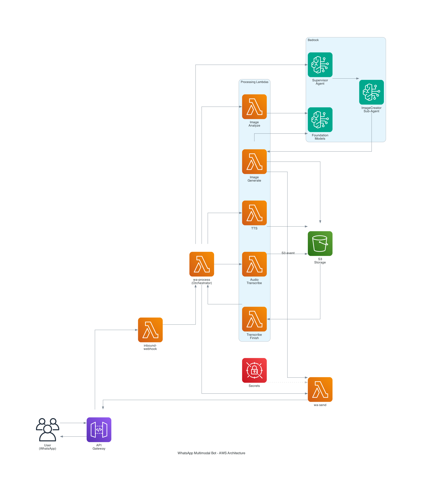

# WhatsApp Multimodal AI Bot - AWS Implementation

A production-ready, serverless WhatsApp bot powered by AWS Bedrock AI agents, supporting text conversations, image analysis, image generation, voice messages, and audio transcription.



## 🌟 Features

- **💬 Natural Conversations**: Powered by Claude 3.5 Sonnet via AWS Bedrock Agents
- **🖼️ Image Analysis**: Analyze images sent by users using Claude 3.5 Sonnet Vision
- **🎨 AI Image Generation**: Generate custom images using Amazon Titan Image Generator v2
- **🎤 Voice Messages**: Text-to-Speech conversion using Amazon Polly
- **🎧 Audio Transcription**: Speech-to-Text using AWS Transcribe
- **🤖 Multi-Agent Architecture**: Supervisor agent delegates tasks to specialized sub-agents
- **⚡ Serverless**: 100% serverless architecture using AWS Lambda
- **🔒 Secure**: Credentials stored in AWS Secrets Manager

## 📋 Table of Contents

- [Architecture](#architecture)
- [Prerequisites](#prerequisites)
- [Quick Start](#quick-start)
- [Deployment](#deployment)
- [Configuration](#configuration)
- [Usage Examples](#usage-examples)
- [Cost Estimation](#cost-estimation)
- [Troubleshooting](#troubleshooting)
- [Contributing](#contributing)
- [License](#license)

## 🏗️ Architecture

### Hybrid Approach

This project uses a **hybrid architecture** that combines:
- **Direct Lambda Processing** for simple operations (image analysis, TTS, transcription)
- **Bedrock Agent Framework** for complex operations (image generation with prompt optimization)

**Why hybrid?** To show different AWS approaches and let you choose what works best for your needs.

👉 See [`ARCHITECTURE_DECISIONS.md`](ARCHITECTURE_DECISIONS.md) for detailed explanation, alternatives, and migration paths.

### Components

1. **API Gateway**: Entry point for WhatsApp webhooks
2. **Lambda Functions** (8 total):
   - `inbound-webhook`: Handles incoming WhatsApp messages
   - `wa-process`: Main orchestrator that routes requests
   - `wa-send`: Sends messages back to WhatsApp
   - `wa-image-analyze`: Analyzes images using Claude Vision
   - `wa-image-generate`: Generates images using Titan
   - `wa-tts`: Converts text to speech
   - `wa-audio-transcribe`: Transcribes audio to text
   - `wa-transcribe-finish`: Handles transcription callbacks

3. **AWS Bedrock**:
   - Supervisor Agent (Claude 3.5 Sonnet)
   - ImageCreator Sub-Agent
   - Foundation Models (Claude, Titan)

4. **S3 Buckets**:
   - Media storage
   - Generated images storage

5. **Secrets Manager**: Stores WhatsApp API credentials

See `whatsapp_bot_architecture.png` for the complete architecture diagram.

## 📦 Prerequisites

- AWS Account with Bedrock access
- Python 3.9+
- AWS CLI configured
- WhatsApp Business API account ([Meta for Developers](https://developers.facebook.com/))
- Bedrock model access:
  - Claude 3.5 Sonnet v2
  - Claude 3.5 Haiku
  - Titan Image Generator v2

## 🚀 Quick Start

### 1. Clone the Repository

```bash
git clone https://github.com/yourusername/multimodal-whatsapp-bot-aws.git
cd multimodal-whatsapp-bot-aws
```

### 2. Review Configuration

```bash
# Review env.example to see what environment variables are needed
cat env.example

# Note: You don't need a .env file for deployment
# Environment variables are set directly in AWS Lambda Console or via CLI
# See ARCHITECTURE_DECISIONS.md for details
```

### 3. Deploy to AWS

#### Option A: Automated Deployment (recommended)

```bash
# Make scripts executable
chmod +x scripts/*.sh
chmod +x deploy-image-generation.sh

# Deploy all components
./scripts/deploy-all-lambdas.sh
```

#### Option B: Manual Deployment

Follow the detailed guide in [`DEPLOYMENT.md`](DEPLOYMENT.md)

### 4. Configure Bedrock Agents

Follow the complete step-by-step guide: [`BEDROCK_AGENT_SETUP.md`](BEDROCK_AGENT_SETUP.md)

This includes:
1. Creating the Supervisor Agent
2. Creating the ImageCreator Sub-Agent
3. Linking agents together
4. Configuring action groups and permissions

Alternative: See [`IMAGE_GENERATION_SETUP.md`](IMAGE_GENERATION_SETUP.md) for image generation specifics.

### 5. Configure WhatsApp Webhook

1. Get your API Gateway URL
2. Add webhook URL to WhatsApp Business API settings
3. Use the verify token you stored in Secrets Manager

## ⚙️ Configuration

### Environment Variables

**Important:** Environment variables are set **per-Lambda** in AWS Console or via CLI, **not** in a `.env` file.

The `env.example` file is a **reference document** showing what variables exist and where they're used.

#### Secrets Manager (WhatsApp Credentials Only)

Store these in AWS Secrets Manager (secret name: `whatsapp-credentials`):
```json
{
  "WHATSAPP_PHONE_NUMBER_ID": "your_phone_number_id",
  "WHATSAPP_ACCESS_TOKEN": "your_access_token",
  "WHATSAPP_VERIFY_TOKEN": "your_verify_token"
}
```

#### Lambda Environment Variables (Set in AWS Console/CLI)

Each Lambda has its own environment variables:
- **wa-process**: `BEDROCK_AGENT_ID`, `BEDROCK_AGENT_ALIAS_ID`, `BEDROCK_REGION`, `MEDIA_BUCKET`
- **wa-image-generate**: `IMAGE_MODEL_ID`, `IMAGE_BUCKET`, `WA_SEND_FUNCTION`
- **inbound-webhook**: `MEDIA_BUCKET`, `WA_PROCESS_FUNCTION`
- etc.

See [`ARCHITECTURE_DECISIONS.md`](ARCHITECTURE_DECISIONS.md) for detailed configuration explanation.

### Bedrock Agent Instructions

Agent instructions are critical for proper functionality:

- **Supervisor Agent**: See `supervisor-agent-instructions.txt`
- **ImageCreator Sub-Agent**: See `wa-image-creator-instructions.txt`

## 💡 Usage Examples

### Text Conversation
```
User: "What's the weather like?"
Bot: [Natural conversation response]
```

### Image Analysis
```
User: [Sends an image]
User: "What's in this image?"
Bot: [Detailed image description]
```

### Image Generation
```
User: "Create an image of a sunset over mountains"
Bot: [Generates and sends image with caption]
```

### Voice Messages
```
User: "Send me a voice message about quantum physics"
Bot: [Sends audio message]
```

### Audio Transcription
```
User: [Sends voice note]
Bot: [Transcribes and responds to the content]
```

## 💰 Cost Estimation

Estimated monthly costs for moderate usage (1000 messages/day):

- **Lambda**: ~$5-10
- **Bedrock Models**: ~$20-30
- **S3 Storage**: ~$1-2
- **API Gateway**: ~$1
- **Other Services**: ~$3-5

**Total: ~$30-50/month**

Costs scale with usage. See [AWS Pricing](https://aws.amazon.com/pricing/) for details.

## 🐛 Troubleshooting

### Common Issues

1. **"Agent returns empty response"**
   - Check agent instructions are properly configured
   - Verify agent is prepared and alias is updated

2. **"Image generation fails"**
   - Ensure Titan Image Generator v2 access is enabled
   - Check IAM permissions for Bedrock InvokeModel

3. **"Webhook verification fails"**
   - Verify VERIFY_TOKEN matches in WhatsApp settings
   - Check API Gateway is publicly accessible

See full troubleshooting guide in [`TROUBLESHOOTING.md`](TROUBLESHOOTING.md)

### Logs

View CloudWatch Logs for each Lambda function:

```bash
aws logs tail /aws/lambda/wa-process --follow
```

## 📚 Additional Documentation

- [`ARCHITECTURE_DECISIONS.md`](ARCHITECTURE_DECISIONS.md) - **Why hybrid architecture? Alternatives & migration paths**
- [`BEDROCK_AGENT_SETUP.md`](BEDROCK_AGENT_SETUP.md) - Complete guide for creating Bedrock agents
- [`DEPLOYMENT.md`](DEPLOYMENT.md) - Deployment overview and options  
- [`IMAGE_GENERATION_SETUP.md`](IMAGE_GENERATION_SETUP.md) - Image generation feature setup
- [`PROJECT_SUMMARY.md`](PROJECT_SUMMARY.md) - Project overview and summary
- [`QUICK_START_IMAGE_GENERATION.md`](QUICK_START_IMAGE_GENERATION.md) - Quick reference for image gen

## 🤝 Contributing

Contributions are welcome! Please:

1. Fork the repository
2. Create a feature branch
3. Make your changes
4. Submit a pull request

## 📄 License

MIT License - see LICENSE file for details

## 🙏 Acknowledgments

- Built with [AWS Bedrock](https://aws.amazon.com/bedrock/)
- Uses [Claude](https://www.anthropic.com/claude) by Anthropic
- Powered by [AWS Lambda](https://aws.amazon.com/lambda/)
- Diagrams created with [diagrams](https://diagrams.mingrammer.com/)

## 📧 Support

For issues or questions:
- Open an issue on GitHub
- Check existing documentation
- Review CloudWatch Logs for errors

---

**Note**: This is a personal project and is not affiliated with or endorsed by Meta, AWS, or Anthropic.

